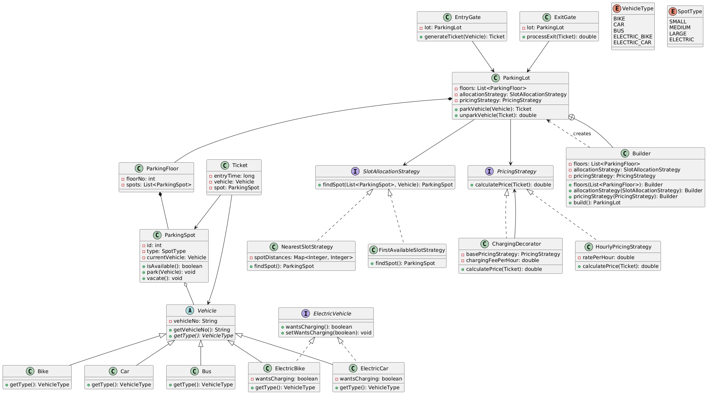

# Parking Lot Management System

A Java parking lot system demonstrating core design patterns with vehicle management and dynamic pricing.

## Features

### Vehicle Management

- **Multiple Vehicle Types**: Support for Bike, Car, Bus, ElectricBike, ElectricCar
- **Smart Compatibility**: Automatic spot type matching based on vehicle size
- **Electric Vehicle Support**: Special handling for charging requirements

### Parking Infrastructure

- **Multi-Spot Types**: SMALL (bikes), MEDIUM (cars), LARGE (buses), ELECTRIC (charging)
- **Flexible Floors**: Support for multiple parking floors
- **Spot Tracking**: Real-time availability monitoring

### Allocation Strategies

- **FirstAvailableSlotStrategy**: Sequential search for immediate parking
- **NearestSlotStrategy**: Distance-optimized allocation for convenience
- **Fallback Logic**: Larger spots accommodate smaller vehicles when needed

### Dynamic Pricing

- **Base Pricing**: Hourly rate system ($10/hour)
- **Electric Charging**: Additional fees for charging services ($5/hour)
- **Flexible Rates**: Easy configuration of pricing models

### System Operations

- **Entry Management**: Ticket generation with timestamp
- **Exit Processing**: Automatic price calculation and payment
- **Real-time Updates**: Spot availability updates on entry/exit

## Design Patterns

- **Strategy Pattern**: Slot allocation and pricing strategies
- **Decorator Pattern**: ChargingDecorator adds fees to base pricing
- **Builder Pattern**: ParkingLot construction

## System Components

### Core Classes

- **ParkingLot**: Main orchestrator managing floors, strategies, and operations
- **ParkingFloor**: Represents individual floors with spot collections
- **ParkingSpot**: Individual parking spaces with type and occupancy tracking
- **Ticket**: Parking receipt containing entry time, vehicle, and spot details

### Vehicle Hierarchy

- **Vehicle** (Abstract): Base class with vehicle number and type
- **Bike/Car/Bus**: Standard vehicles with size-based spot requirements
- **ElectricVehicle** (Interface): Charging preference management
- **ElectricBike/ElectricCar**: Electric variants with charging capabilities

### Entry/Exit Gates

- **EntryGate**: Handles vehicle arrival, spot allocation, and ticket generation
- **ExitGate**: Processes departures, calculates fees, and frees spots

### Strategy Implementations

- **Allocation**: FirstAvailable (O(n)) vs Nearest (distance-optimized)
- **Pricing**: Hourly base rates with decorators for additional services

## Class Diagram



## Usage

```java
// Setup with decorator pattern
PricingStrategy basePricing = new HourlyPricingStrategy(10.0);
PricingStrategy pricingWithCharging = new ChargingDecorator(basePricing, 5.0);

ParkingLot lot = new ParkingLot.Builder()
    .floors(floors)
    .allocationStrategy(new FirstAvailableSlotStrategy())
    .pricingStrategy(pricingWithCharging)
    .build();

// Park and exit
Vehicle car = new Car("ABC-123");
Ticket ticket = entryGate.generateTicket(car);
double price = exitGate.processExit(ticket);
```

## Running

```bash
javac *.java
java Main
```

## Example Output

```
=== Parking Lot Demo ===
Bike1 parked at spot 1
Bike2 parked at spot 2
Car parked at spot 3
Bike3 parked at spot 4
Electric car parked at spot 5 (Type: ELECTRIC)
Electric bike parked at spot 6 (Type: ELECTRIC)
Extra car could not be parked - no spots available
Bike1 exited, price = $10.00
Electric car exited, price = $15.00 (includes charging fee)
Extra car now parked at spot 5
```

## Key Design Principles

- **Open/Closed Principle**: Easy extension without modifying existing code
- **Single Responsibility**: Each class has one clear purpose
- **Strategy Pattern**: Runtime algorithm selection for allocation and pricing
- **Decorator Pattern**: Dynamic feature enhancement (charging fees)
- **Composition over Inheritance**: Flexible object relationships
- **Builder Pattern**: Complex object construction with validation
